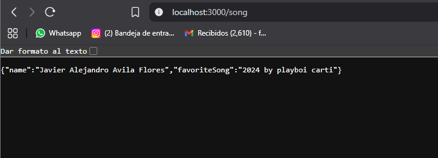
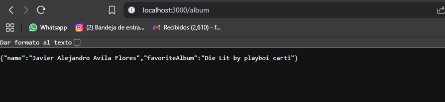
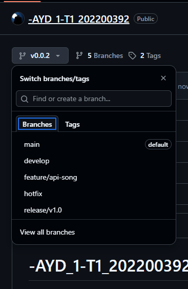
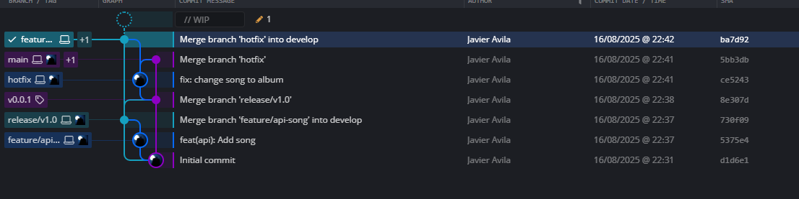

# Tarea 1 - AYD1

| Nombre                          | Carnet    |
|----------------------------------|-----------|
| Javier Alejandro Avila Flores    | 202200392 |

---

## Codigo final del api:
```js
const express = require('express');
const app = express();
const port = 3000;

app.get('/', (req, res) => {
    res.send('Hello World!');
});

app.get('/album', (req, res) => {
    res.json({
        name: "Javier Alejandro Avila Flores",
        favoriteAlbum: "Die Lit by playboi carti",
    });
});


app.listen(port, () => {
    console.log(`http://localhost:${port}`);
});
```

## Salida antes del hotfix



## Salida luego del hotfix



## Captura de las ramas (con hotfix)



## Captura git kraken

